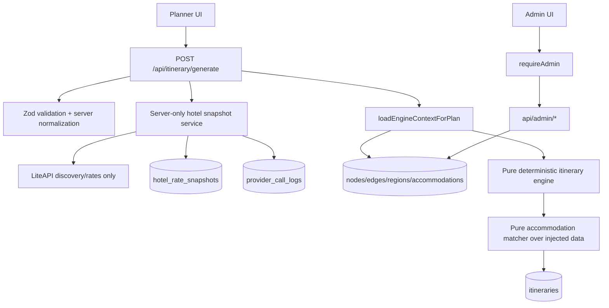

# Prototype V2 Final Implementation Plan

## 1. Final Architecture

Prototype v2 moves WanderBharat from mock-ish Rajasthan data to admin-curated, provenance-aware Rajasthan data with LiteAPI hotel price discovery. It does not add booking, payments, refunds, cancellations, affiliate checkout, flight booking, flight price discovery, or runtime LLM planning.

The final architecture keeps the current App Router shape:

1. Client UI collects planning inputs and displays itinerary/data-state labels.
2. Server route handlers validate requests, resolve auth, call Firestore repositories, optionally call server-only provider services, and persist snapshots.
3. `loadEngineContextForPlan` loads Firestore data and resolves region-local planning facts such as day-of-week.
4. `src/lib/itinerary/` stays deterministic and pure over injected inputs. It does not import Firestore, LiteAPI, Google APIs, `fetch`, or provider clients.
5. The accommodation planner consumes curated accommodations plus already-loaded hotel rate snapshots through dependency injection. It never fetches LiteAPI directly.
6. Admin pages and `api/admin/*` handlers use one shared `requireAdminUser()` guard.

Final runtime flow:



Key decisions from reconciliation:

- Provenance belongs on source records only: nodes, accommodations, attraction hours, attraction admission, hotel rate snapshots, and provider call logs. Derived itinerary records get rolled-up confidence/data-state labels, not full provenance fields.
- `trip_start_date` is a `YYYY-MM-DD` local-date string. `trip_end_date` is derived from `trip_start_date + days - 1` and is not persisted as a separate source of truth.
- Region-local day-of-week is resolved before the engine using `regions.timezone`. `daySchedule.ts` consumes resolved day indexes and never computes dates or timezones.
- `children` remains available as the count used by existing room allocation. New v2 requests also carry `children_ages`, and new writes keep `children === children_ages.length`.
- LiteAPI calls are server-only, kill-switchable, quota-bounded, and limited to hotel discovery/rate snapshots. Raw LiteAPI response types do not leave the client module.
- Snapshot keys exclude `fetched_at`; `fetched_at` is data, not identity.
- No long-lived `GraphNode.source` alias. A one-shot v2 migration/reseed writes `source_type` and removes the old field for Rajasthan data.
- No `data_quality_runs` collection and no import UI in prototype v2. Data-quality metrics are computed on demand.
- Public region exposure can be narrowed during rollout via `WB_ALLOWED_REGIONS` (for example, Rajasthan-only) without changing admin/seed tooling scope.

## 2. Final Firestore Collection Design

### Existing Collections

`regions`

- Add `timezone`, required for v2 records. Use IANA names such as `Asia/Kolkata`.
- Keep `default_currency`, `default_locale`, `default_transport_modes`, `bbox`, and `updated_at`.
- Admin can edit `timezone`, defaults, and display metadata.

`nodes`

- Continue storing cities, attractions, hotels, hubs, and future node types together.
- Add source-record fields:
  - `data_version: 2`
  - `source_type: "seed" | "manual" | "google_places" | "legacy" | "import"`
  - `confidence: "verified" | "estimated" | "unknown" | "legacy_estimate"`
  - `source_url?: string | null`
  - `fetched_at?: number | null`
  - `verified_at?: number | null`
  - `verified_by?: string | null`
- Remove old `source` during the Rajasthan v2 migration/reseed.
- For attractions, put hours and admission under `metadata.hours` and `metadata.admission`, each with its own source metadata.
- Unknown attraction costs are `amount: null`, never `0`.

`edges`

- Keep edge data focused on route graph facts: `distance_km`, `travel_time_hours`, `regions`, and `metadata`.
- Continue using `metadata.provider`, `metadata.resolved_at`, `metadata.encoded_polyline`, and `metadata.estimated_cost` for route-provider data.
- Do not add human verification fields to computed Google Routes edges.
- Admin gets an edges explorer for spotting bad travel times; write editing can stay minimal in v2.

`accommodations`

- Keep curated hotel records separate from rate snapshots.
- Add source-record fields similar to nodes.
- Add `provider_refs: Array<{ provider: "liteapi"; external_id: string; confidence: DataConfidence; mapped_at: number }>` for curated-to-provider mapping.
- Keep curated baseline prices as `MonetaryValue` with `confidence: "legacy_estimate" | "estimated" | "verified"`, never as silently verified prices.
- Rate selection precedence is: matching LiteAPI snapshot > curated baseline estimate > unknown.

`itineraries`

- Persist `trip_start_date`, `days`, preferences, stays, activities, and rolled-up budget/data-state labels.
- Do not persist `trip_end_date`.
- Budget line items use `MonetaryValue`; totals can be `null` or range-aware when any required component is unknown.
- Legacy itinerary reads are normalized for display, but old values are labelled `legacy_estimate` and are never upgraded to verified.

`users`

- No schema change is required for prototype v2.
- Admin authorization is server-side and checks `users/{uid}.role === "admin"`.
- Bootstrap admin access with `npm run grant:admin -- --uid <firebase-uid>` (or `--email <user@example.com>`), which writes that role via Firebase Admin SDK.

### New Collections

`hotel_rate_snapshots`

- Server-written and client-denied by Firestore rules.
- Document id is a deterministic cache key from normalized logical inputs, excluding `fetched_at`.
- Required fields:
  - `key`
  - `provider: "liteapi"`
  - `region`
  - `city_node_id?: string`
  - `accommodation_id?: string`
  - `provider_hotel_id?: string`
  - `check_in: YYYY-MM-DD`
  - `check_out: YYYY-MM-DD`
  - `occupancy: { adults: number; children_ages: number[]; rooms: number }`
  - `guest_nationality: string`
  - `requested_currency: string`
  - `returned_currency: string`
  - `rates: HotelRateOffer[]`
  - `source_type: "liteapi"`
  - `confidence: "estimated" | "verified" | "unknown"`
  - `fetched_at: number`
  - `request_fingerprint`
  - `provider_call_log_id?: string`
- No booking ids, payment links, checkout links, or raw provider payloads.

`provider_call_logs`

- Server-written and client-denied by Firestore rules.
- Required fields:
  - `provider`
  - `operation: "hotel_discovery" | "hotel_rates"`
  - `region`
  - `requested_at`
  - `duration_ms`
  - `status: "success" | "provider_error" | "timeout" | "disabled" | "rate_limited" | "validation_error"`
  - `http_status?: number`
  - `correlation_id`
  - `request_fingerprint`
  - `cache_key?: string`
  - `error_class?: string`
  - `sanitized_error?: string`
  - `ttl_expires_at`
- Retention target is 30 days.
- Logs must strip Authorization headers, API keys, request bodies with personal data, and raw provider payloads.

Collections explicitly not added in v2:

- `data_quality_runs`
- `accommodation_provider_mappings`
- `imports`
- booking/payment/flight collections

## 3. Final TypeScript Type Design

Add shared primitives in `src/types/domain.ts`:

```ts
export type LocalDateString = string; // YYYY-MM-DD
export type IanaTimezone = string;
export type DayOfWeek = 0 | 1 | 2 | 3 | 4 | 5 | 6; // Sunday = 0

export type DataConfidence =
  | "verified"
  | "estimated"
  | "unknown"
  | "legacy_estimate";

export type SourceType =
  | "seed"
  | "manual"
  | "google_places"
  | "google_routes"
  | "liteapi"
  | "legacy"
  | "import"
  | "computed";

export interface SourceProvenance {
  source_type: SourceType;
  confidence: DataConfidence;
  source_url?: string | null;
  fetched_at?: number | null;
  verified_at?: number | null;
  verified_by?: string | null;
}

export interface MonetaryValue {
  amount: number | null;
  currency: string;
  confidence: DataConfidence;
}
```

Use field-specific legal subsets in comments and validation. For example, `hotel_rate_snapshots.source_type` can only be `"liteapi"`, while attraction hours can be `"manual" | "seed" | "google_places" | "legacy"`.

Attraction hours:

```ts
export interface AttractionHours extends SourceProvenance {
  timezone: IanaTimezone;
  periods: AttractionOpeningPeriod[];
  note?: string | null;
}

export interface AttractionOpeningPeriod {
  day: DayOfWeek;
  open: string; // HH:MM local time
  close: string; // HH:MM local time
}
```

Rules:

- Multiple intervals on the same day are allowed by repeating `day`.
- Overnight spans and seasonal calendars are out of scope for prototype v2. Store them in `note` as `confidence: "unknown" | "estimated"` until explicitly modeled.

Attraction admission:

```ts
export type AdmissionCategory =
  | "adult"
  | "child"
  | "domestic"
  | "foreigner"
  | "student"
  | "senior";

export interface AttractionAdmission extends SourceProvenance {
  currency: string; // region currency
  prices: Array<{
    category: AdmissionCategory;
    value: MonetaryValue;
  }>;
  note?: string | null;
}
```

Rules:

- Admission costs are stored in the node region currency.
- UI may display conversion later, but v2 does not implement FX conversion.
- `guest_nationality` maps to `domestic` for `IN`, otherwise `foreigner`, via a pure helper.

Traveller and request types:

```ts
export interface TravellerComposition {
  adults: number;
  children: number;
  children_ages?: number[];
  rooms?: number;
  guest_nationality?: string; // ISO 3166-1 alpha-2, uppercase
}

export interface GenerateItineraryInput {
  regions: string[];
  start_node: string;
  end_node?: string;
  requested_city_ids?: string[];
  days: number;
  trip_start_date: LocalDateString;
  preferences: ItineraryPreferences;
  user_id?: string;
}
```

Validation rules:

- `trip_start_date` is required for v2 generation and must match `YYYY-MM-DD`.
- `days` remains capped by `MAX_TRIP_DAYS`.
- New v2 requests require `children_ages.length === children`.
- Child ages are integers from 0 through 17.
- `rooms` defaults to 1 and is capped conservatively.
- `guest_nationality` defaults to `IN`.
- `preferences.budget.currency` is required for new v2 requests and defaults from `regions.default_currency` when the server can safely infer it.

Engine context:

```ts
export interface PlanningDay {
  day_index: number;
  local_date: LocalDateString;
  day_of_week: DayOfWeek;
}

export interface EngineContext {
  nodes: GraphNode[];
  edges: GraphEdge[];
  attractionsByCity?: Map<string, GraphNode[]>;
  planning_days: PlanningDay[];
  now?: () => number;
  makeId?: (prefix: string) => string;
  tuningOverride?: EngineTuningOverride;
}
```

LiteAPI types:

- Raw LiteAPI request/response types stay private to `src/lib/services/liteApiClient.ts`.
- Cross-boundary types are internal app types only: `HotelDiscoveryResult`, `HotelRateSnapshot`, `HotelRateOffer`, and `ProviderCallLog`.
- `liteApiClient.ts`, `hotelRateSnapshotService.ts`, and admin/provider modules start with `import "server-only";`.

## 4. Final Phase Sequence

Every phase is intended to be a small PR. Each phase must preserve the pure deterministic engine and must finish with lint, typecheck, tests, and build passing unless explicitly blocked by missing external credentials.

### Phase 0: Safety Brake And Export Guidance

Branch: `proto-v2/00-safety-purge-export`

Commit: `chore(proto-v2): add purge safety brakes`

Scope:

- Expand `scripts/purge.ts` to understand `accommodations`, `hotel_rate_snapshots`, and `provider_call_logs`.
- Make dry-run the default.
- Require `--yes` plus a typed confirmation token for destructive runs.
- Keep `users` excluded by default.
- Require a separate explicit flag to delete provider call logs.
- Add export-first documentation to the script/help output and admin plan docs.

Acceptance criteria:

- Dry-run prints exact collection filters and document counts without writes.
- Destructive purge cannot run without both safeguards.
- Users/admin role sources are preserved by default.
- Provider logs require a separate explicit delete flag.
- Tests prove dry-run performs no writes.

Test commands:

```bash
node --import tsx --test scripts/purge.test.ts
npm run typecheck
npm run lint
npm test
npm run build
```

### Phase 1: Schema V2 Contracts

Branch: `proto-v2/01-schema-contracts`

Commit: `feat(proto-v2): add v2 data contracts`

Scope:

- Add `SourceProvenance`, `DataConfidence`, `MonetaryValue`, `AttractionHours`, `AttractionAdmission`, `PlanningDay`, and hotel snapshot types.
- Extend `GenerateItineraryInput`, validation, repository normalization, and `RegionSummary.timezone`.
- Add Firestore collection constants for `hotel_rate_snapshots` and `provider_call_logs`.
- Update Firestore rules so new collections are client-denied.
- Keep legacy itinerary reads displayable, labelled as legacy estimates.

Acceptance criteria:

- New generation requests require `trip_start_date`, currency, and valid traveller details.
- Unknown costs are represented as `MonetaryValue.amount === null`.
- `children` remains available for existing planning logic.
- Region timezone is available to context loading.
- Firestore rules deny client reads/writes to snapshots and provider logs.

Test commands:

```bash
node --import tsx --test src/lib/api/validation.test.ts src/lib/repositories/itineraryRepository.test.ts
node --import tsx --test src/lib/firebase/firestoreRules.test.ts
npm run typecheck
npm run lint
npm test
npm run build
```

### Phase 2: Rajasthan Migration And Reseed

Branch: `proto-v2/02-rajasthan-migrate-reseed`

Commit: `feat(proto-v2): migrate rajasthan seed data to v2`

Scope:

- Add a one-shot Rajasthan v2 migrator with `--dry-run`.
- Update Rajasthan seeds for nodes, attractions, accommodations, and regions.
- Backfill `data_version`, `source_type`, confidence, region timezone, hours/admission shells, and curated baseline hotel money values.
- Remove `GraphNode.source` from v2 Rajasthan writes.
- Mark old numeric data as `legacy_estimate` or `estimated`, never verified.

Acceptance criteria:

- Migration dry-run lists every changed field and never writes.
- Reseeded Rajasthan data has no `source` legacy field.
- Unknown attraction/hotel prices are `null`, not `0`.
- Region `rajasthan` has `timezone: "Asia/Kolkata"`.
- Seed scripts can run Rajasthan-only without broad India changes.

Test commands:

```bash
node --import tsx --test scripts/migrateToSchemaV2.test.ts scripts/data/rajasthan.test.ts
npm run db:purge -- --region rajasthan --dry-run
npm run typecheck
npm run lint
npm test
npm run build
```

### Phase 3: Admin Guard And Data Quality Dashboard

Branch: `proto-v2/03-admin-data-quality`

Commit: `feat(admin): add guarded data quality dashboard`

Scope:

- Add `src/lib/auth/admin.ts` with one `requireAdminUser()` contract.
- Add `src/app/admin/layout.tsx` and admin overview.
- Add read-only `/admin/data-quality`.
- Data-quality metrics are computed on demand and not persisted.
- Add a CLI bootstrap path for admin role assignment (`npm run grant:admin`) so locked-out operators can self-serve access safely.
- Add admin route tests for unauthenticated, non-admin, expired session, and mismatched bearer token cases.

Acceptance criteria:

- Every admin page and `api/admin/*` handler calls the same guard.
- Non-admin users cannot access admin pages or admin APIs.
- Forbidden-state copy points operators to `npm run grant:admin` instead of ad-hoc Firestore console edits.
- Dashboard reports missing provenance, unknown costs, unverified hours, missing region timezone, stale/absent hotel snapshots, and legacy-estimated values.
- No admin route exposes provider secrets or raw logs.

Test commands:

```bash
node --import tsx --test src/lib/auth/admin.test.ts src/app/api/admin/data-quality/route.test.ts
npm run typecheck
npm run lint
npm test
npm run build
```

### Phase 4: Admin Data Correction Tools

Branch: `proto-v2/04-admin-data-correction`

Commit: `feat(admin): add rajasthan data correction tools`

Scope:

- Add `/admin/attractions` and `/admin/attractions/[id]` for attraction metadata, hours, and admission in one detail view.
- Add `/admin/cities/[id]` for city description, tags, recommended hours, and cost confidence.
- Add `/admin/regions` for timezone/default currency/default locale.
- Add `/admin/edges` as a route explorer for spotting wrong travel times.
- Add server route handlers for edits, all behind `requireAdminUser()`.

Acceptance criteria:

- Admins can correct Rajasthan attraction hours and admission without editing seed JSON.
- Admins can correct city-level cost/metadata labels.
- Region timezone can be fixed before date-aware scheduling ships.
- Edge explorer is read-only unless a tiny safe edit endpoint is added.
- All write APIs validate `MonetaryValue` and source metadata.

Test commands:

```bash
node --import tsx --test src/app/api/admin/attractions/route.test.ts src/app/api/admin/regions/route.test.ts
npm run typecheck
npm run lint
npm test
npm run build
```

### Phase 5: Date-Aware Scheduling

Branch: `proto-v2/05-date-aware-scheduling`

Commit: `feat(itinerary): schedule against region-local attraction hours`

Scope:

- Add trip start date to planner UI, API payload, persistence, and itinerary display.
- Resolve `PlanningDay[]` in `loadEngineContextForPlan` using region timezone.
- Teach pure scheduling to consume resolved `day_of_week` and structured attraction hours.
- Add deterministic fallback behavior for unknown hours: do not claim verified availability; use existing heuristic only as estimated.
- Add closed-day avoidance.

Acceptance criteria:

- No new date/timezone logic under `src/lib/itinerary/` uses `Date` or timezone APIs directly.
- Closed attractions are skipped on the matching local day when alternatives exist.
- Unknown hours remain labelled unknown or estimated in output.
- Golden Rajasthan itinerary is deterministic with fixed input and `ctx.now = () => 0`.

Test commands:

```bash
node --import tsx --test src/lib/itinerary/daySchedule.test.ts src/lib/itinerary/engine.test.ts src/lib/itinerary/goldenRajasthan.test.ts
npm run typecheck
npm run lint
npm test
npm run build
```

### Phase 6: Traveller Details

Branch: `proto-v2/06-traveller-details`

Commit: `feat(planner): collect traveller ages rooms and nationality`

Scope:

- Add `children_ages`, `rooms`, and `guest_nationality` to planner UI.
- Normalize defaults server-side.
- Keep room allocation driven by `children` count while preserving ages for LiteAPI and admission-tier logic.
- Add pure helper for nationality-to-admission-category.

Acceptance criteria:

- New requests validate children ages, room count, and nationality.
- `children` equals `children_ages.length` for new writes.
- Old itineraries still render without claiming traveller ages are known.
- Domestic/foreigner admission category selection is deterministic and tested.

Test commands:

```bash
node --import tsx --test src/lib/api/validation.test.ts src/lib/itinerary/roomAllocation.test.ts src/lib/itinerary/admissionCategory.test.ts src/lib/planFormNumberFields.test.ts
npm run typecheck
npm run lint
npm test
npm run build
```

### Phase 7: Budget And Data-Honesty UI

Branch: `proto-v2/07-budget-data-honesty`

Commit: `feat(itinerary): show budget confidence and unknown values`

Scope:

- Thread `MonetaryValue` through budget presentation, timeline, stays, hero/stats, and map DTOs.
- Centralize display labels for `verified`, `estimated`, `unknown`, `legacy_estimate`, live, and cached.
- Prevent `null` money from rendering as `0`, `NaN`, or verified totals.
- Use ranges or incomplete-total copy when hotel/admission data is unknown.

Acceptance criteria:

- UI never displays unknown attraction or hotel cost as `₹0`.
- Estimated and legacy values are visibly labelled.
- Budget totals become incomplete/ranged when required components are unknown.
- Existing itinerary pages still render legacy itineraries.

Test commands:

```bash
node --import tsx --test src/lib/itinerary/budgetPanelPresentation.test.ts src/lib/itinerary/timelinePresentation.test.ts src/lib/itinerary/pageModel.test.ts src/components/itinerary/redesignedItineraryPage.test.ts
npm run typecheck
npm run lint
npm test
npm run build
```

### Phase 8: LiteAPI Discovery And Rate Snapshots

Branch: `proto-v2/08-liteapi-snapshots`

Commit: `feat(liteapi): add server-only hotel rate snapshots`

Scope:

- Add server-only LiteAPI client for discovery and rates only.
- Add `hotelRateSnapshotKey` pure helper.
- Add hotel snapshot repository and provider call log repository.
- Add `hotelRateSnapshotService` with `LITEAPI_ENABLED=false` kill switch, timeout, no secret leakage, and per-run call budget.
- Add admin LiteAPI test console for discovery/rates only.
- Add env docs for `LITEAPI_API_KEY`, `LITEAPI_BASE_URL`, and `LITEAPI_ENABLED`.

Acceptance criteria:

- `import "server-only"` exists in LiteAPI client, snapshot service, and admin provider files.
- Raw LiteAPI types do not escape the client module.
- Snapshot key is deterministic and excludes `fetched_at`.
- Provider failures create sanitized logs and do not expose API keys.
- Kill switch prevents all provider fetches.
- Admin console cannot call booking/payment endpoints.

Test commands:

```bash
node --import tsx --test src/lib/services/liteApiClient.test.ts src/lib/services/hotelRateSnapshotService.test.ts src/lib/services/hotelRateSnapshotKey.test.ts
node --import tsx --test src/lib/repositories/hotelRateSnapshotRepository.test.ts src/lib/repositories/providerCallLogRepository.test.ts
npm run typecheck
npm run lint
npm test
npm run build
```

### Phase 9: Accommodation Planner Snapshot Matching

Branch: `proto-v2/09-accommodation-snapshot-matching`

Commit: `feat(itinerary): match accommodations with hotel rate snapshots`

Scope:

- Update generate route to load or refresh hotel snapshots before accommodation planning.
- Pass already-loaded snapshots into the accommodation planner dependency boundary.
- Match snapshots by region, dates, rooms, travellers, children ages, nationality, currency, and provider refs.
- Apply precedence: snapshot rate > curated baseline estimate > unknown.
- Keep itinerary generation non-blocking on LiteAPI availability.

Acceptance criteria:

- Pure accommodation planner performs no network or Firestore reads.
- LiteAPI outage returns cached snapshot or unknown hotel price, not a 500 solely because rates are unavailable.
- Snapshot labels show live/cached/unknown clearly.
- Budget hard gates do not treat unknown hotel prices as free.

Test commands:

```bash
node --import tsx --test src/app/api/itinerary/generate/route.test.ts src/lib/itinerary/accommodation.test.ts src/lib/itinerary/accommodationBudget.test.ts
npm run typecheck
npm run lint
npm test
npm run build
```

### Phase 10: Rajasthan Quality Gate

Branch: `proto-v2/10-rajasthan-quality-gate`

Commit: `chore(proto-v2): add rajasthan quality gate`

Scope:

- Add a documented quality checklist for Rajasthan.
- Add admin dashboard thresholds for prototype readiness.
- Add final no-go checks for booking/payments/flights/runtime LLM/provider leakage.
- Add or update smoke tests for the complete generate-to-display flow.

Acceptance criteria:

- `/admin/data-quality` shows no mock-as-real findings for Rajasthan.
- Required Rajasthan regions/cities/attractions have source metadata and confidence labels.
- At least one narrow LiteAPI rate-discovery matrix exists for Rajasthan test dates and common occupancy.
- Golden deterministic itinerary test is green.
- No new booking, payment, checkout, refund, cancellation, affiliate, or flight implementation exists.

Test commands:

```bash
npm run ci
npm run build
npm run typecheck
npm run lint
npm test
```

## 5. Acceptance Criteria Summary

Prototype v2 is complete when:

- Admins can inspect and correct Rajasthan data quality without editing JSON seeds for normal fixes.
- Firestore source records distinguish verified, estimated, unknown, and legacy-estimated data.
- Unknown attraction and hotel costs are never stored or displayed as `0`.
- Trip generation accepts trip start date, traveller ages, rooms, nationality, and currency.
- Date-aware attraction scheduling uses region-local day-of-week and stays deterministic.
- LiteAPI hotel discovery/rate snapshots work server-side, have sanitized logs, and never expose booking/payment flows.
- Itinerary generation remains available when LiteAPI is disabled or failing.
- The pure engine remains free of Firestore, provider clients, network calls, runtime LLMs, and un-injected clocks.
- Rajasthan passes the quality gate before any broader region rollout.

## 6. Rollback Plan

Code rollback:

- Each phase lands on its own branch and PR. Revert the phase PR if it causes product or CI regressions.
- Prefer reverting the newest phase first because phases are intentionally layered.
- If deployment is involved, roll back to the previous green deployment after reverting or disabling the affected feature flag/env.

Data rollback:

- Before any destructive purge or migration, export the affected Firestore collections.
- Use Phase 0 dry-run output as the rollback checklist: `nodes`, `edges`, `regions`, `accommodations`, `itineraries`, `hotel_rate_snapshots`, and `provider_call_logs`.
- If migration data is wrong, restore from export or rerun Rajasthan reseed after a targeted dry-run purge.
- Never purge `users` as part of prototype rollback.

LiteAPI rollback:

- Set `LITEAPI_ENABLED=false` to stop all provider calls immediately.
- Remove or rotate `LITEAPI_API_KEY` if secret leakage is suspected.
- Keep existing snapshots for debugging unless they are corrupt; snapshot deletion requires a targeted purge with confirmation.
- Provider call logs are sanitized and TTL-bound, but can be purged separately if needed.

Admin rollback:

- Disable admin navigation first if UI is broken.
- Keep `requireAdminUser()` in place even when rolling back individual admin pages.
- If an admin write endpoint is suspect, disable that route or revert that phase before touching data.

Schema rollback:

- V2 fields are additive except the planned Rajasthan removal of `GraphNode.source`.
- If rollback to pre-v2 code is needed, restore the pre-migration export or reseed the old Rajasthan dataset.
- Legacy itinerary normalization must remain until old itineraries are no longer needed.

Quality gate rollback:

- If the final gate fails, do not broaden beyond Rajasthan.
- Leave v2 behind admin controls, disable LiteAPI live calls, and keep generating itineraries from curated/snapshotted data until the failing metric is corrected.
