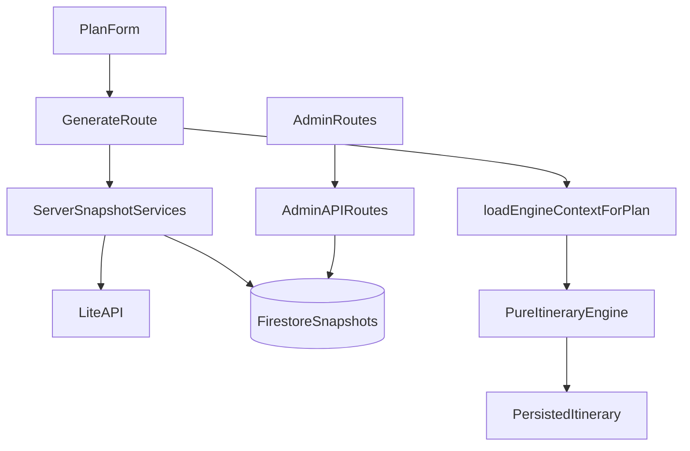

# Real-Data Prototype V2 Upgrade Plan

## Proposed Architecture Changes

Keep the current shape: App Router route handlers and scripts perform I/O, repositories persist snapshots, and `src/lib/itinerary/` stays deterministic over injected data.

- Add shared provenance primitives in [src/types/domain.ts](src/types/domain.ts), then reuse them on nodes, edges, accommodations, attraction costs/hours, hotel snapshots, itinerary budget lines, and map/timeline DTOs. Do not create duplicate v2-only types that drift from existing `GraphNode`, `Accommodation`, `Itinerary`, and `ItineraryPreferences`.
- Add server-only provider modules under [src/lib/services/](src/lib/services/) for LiteAPI discovery/rates. Match the existing `placesService.ts` and `distanceService.ts` pattern: explicit option types, injected `fetch`/API key where useful for tests, no client imports, no booking endpoints.
- Add repositories for new persisted snapshots and logs under [src/lib/repositories/](src/lib/repositories/) and centralize collection names in [src/lib/firebase/collections.ts](src/lib/firebase/collections.ts).
- Add admin-only pages under [src/app/admin/](src/app/admin/) and admin-only route handlers under `src/app/api/admin/...`. Prefer a server layout/helper guard over broad middleware at first, because current auth is cookie-based and all admin operations are server-rendered/server-handled.
- Keep date-aware and hours-aware scheduling deterministic by passing `trip_start_date` into the request and resolving day-of-week availability from snapshotted attraction metadata. No provider calls from `engine.ts`, `daySchedule.ts`, `scoring.ts`, or other pure itinerary helpers.

## Collection And Schema Changes

- Extend existing `GraphNode`, `GraphEdge`, `Accommodation`, `Itinerary`, `ItineraryBudgetLineItem`, `StayAssignment`, and `ItineraryActivity` in [src/types/domain.ts](src/types/domain.ts).
- Add shared fields:
  - `data_version: 2`
  - `source_type: "seed" | "manual" | "google_places" | "google_routes" | "liteapi" | "computed" | "import"`
  - `confidence: "verified" | "estimated" | "unknown"`
  - `source_url?: string | null`
  - `fetched_at?: number | null`
  - `verified_at?: number | null`
  - `verified_by?: string | null`
- Preserve the existing `GraphNode.source` only as a legacy alias during migration; new reads/writes should use `source_type`.
- Trip request/preferences changes:
  - `GenerateItineraryInput.trip_start_date`
  - derived or stored `trip_end_date`
  - `TravellerComposition.adults`, `children_ages`, `rooms`, `guest_nationality`
  - canonical currency through `preferences.budget.currency`, with `currency` included in hotel rate requests.
- Attraction hours model on `NodeMetadata`:
  - `opening_periods?: Array<{ day: 0|1|2|3|4|5|6; open: string; close: string }>`
  - `closed_days?: Array<0|1|2|3|4|5|6>`
  - `hours_note?: string | null`
  - provenance fields scoped to hours if needed: `hours_source_type`, `hours_confidence`, `hours_fetched_at`, `hours_verified_at`, `hours_verified_by`.
- Attraction cost model on `NodeMetadata` or a nested `admission` field:
  - `admission_costs?: Array<{ category: "adult" | "child" | "domestic" | "foreigner" | "student" | "senior"; amount: number | null; currency: string; confidence: "verified" | "estimated" | "unknown"; source_url?: string | null; verified_at?: number | null }>`
  - Unknown cost remains `amount: null`, never `0`.
- New collections in [src/lib/firebase/collections.ts](src/lib/firebase/collections.ts):
  - `hotel_rate_snapshots`: LiteAPI search/rate results keyed by provider, hotel, destination, dates, occupancy, currency, and fetched time.
  - `provider_call_logs`: sanitized provider request metadata, status, duration, error class, and correlation id. Never store secrets or full raw payloads containing sensitive fields.
  - Optional later: `data_quality_runs` if dashboard metrics need persisted history. For the first pass, the dashboard can compute current health on demand.
- Update [firestore.rules](firestore.rules) so public/reference collections remain read-only client-side. New admin/log/snapshot collections should be client-read false and server-only unless a specific public projection is needed.

## File-By-File Implementation Plan

### Domain, Validation, And Contracts

- [src/types/domain.ts](src/types/domain.ts): extend existing interfaces with provenance, dates, richer travellers, nullable/ranged cost fields, structured attraction hours, admission costs, hotel snapshot/rate types, and data-state labels. Keep everything region-agnostic.
- [src/lib/api/validation.ts](src/lib/api/validation.ts): extend `generateItinerarySchema` for `trip_start_date`, derived end-date checks, `children_ages`, `rooms`, `guest_nationality`, and currency. Add date consistency validation: start date required, end date either omitted or equals `start + days - 1`.
- [src/lib/itinerary/planningLimits.ts](src/lib/itinerary/planningLimits.ts): update traveller normalisation from `children` count to `children_ages.length` while preserving old saved itinerary reads through repository normalisation.
- [src/lib/repositories/itineraryRepository.ts](src/lib/repositories/itineraryRepository.ts): normalize legacy itineraries into v2 shape without pretending old mock values are real. Do not coerce unknown/null costs to `0` except where old numeric totals must remain displayable as legacy estimates.

### Engine And Deterministic Scheduling

- [src/lib/itinerary/loadContext.ts](src/lib/itinerary/loadContext.ts): filter or annotate attraction candidates by day-of-week availability using the already-loaded node metadata and trip date. This is the right boundary for date-aware pruning before pure route allocation.
- [src/lib/itinerary/engine.ts](src/lib/itinerary/engine.ts): replace `avg_daily_cost ?? 0` style budget assumptions with cost states/ranges. Keep route selection deterministic using only loaded metadata. Include admission cost metadata on `ItineraryActivity` via `toActivity`.
- [src/lib/itinerary/daySchedule.ts](src/lib/itinerary/daySchedule.ts): teach `fitsActivityWindow` to use structured `opening_periods` for the itinerary date/day index, not only `opening_time`/`closing_time`.
- [src/lib/itinerary/accommodation.ts](src/lib/itinerary/accommodation.ts): accept rate snapshots through repository dependencies, match stays by trip dates/occupancy/rooms/currency, and return unknown or cached price states when no rate exists.
- [src/lib/itinerary/accommodationBudget.ts](src/lib/itinerary/accommodationBudget.ts) and [src/lib/itinerary/budgetPanelPresentation.ts](src/lib/itinerary/budgetPanelPresentation.ts): support `amount: number | null`, ranges, and data status labels. Do not let subtotal math silently convert unknown admissions or unavailable hotel rates into zero-cost travel.

### LiteAPI Integration

- Add `src/lib/services/liteApiClient.ts`: server-only LiteAPI client with hotel discovery and rate lookup only. Include typed request/response mapping, timeout handling, retry policy if needed, and injected `fetch` for tests.
- Add `src/lib/services/hotelRateSnapshotService.ts`: orchestration around LiteAPI calls, snapshot keys, stale/fresh decisions, and sanitized call logging.
- Add `src/lib/repositories/hotelRateSnapshotRepository.ts` and `src/lib/repositories/providerCallLogRepository.ts` for Firestore persistence.
- Update [src/lib/repositories/accommodationRepository.ts](src/lib/repositories/accommodationRepository.ts): keep curated accommodations but allow provider identity fields such as `provider`, `provider_hotel_id`, `source_type`, and LiteAPI metadata. Do not make live LiteAPI calls from this repository.
- Update [.env.example](.env.example) and [.github/workflows/ci.yml](.github/workflows/ci.yml) with server-only LiteAPI placeholders such as `LITEAPI_API_KEY` and `LITEAPI_BASE_URL`. Do not use `NEXT_PUBLIC_` for LiteAPI.

### Admin Routes And UI

- Add `src/lib/auth/admin.ts`: admin guard using Firebase custom claims or an explicit env allowlist such as `ADMIN_EMAILS`/`ADMIN_UIDS`. Prefer custom claims long term; env allowlist is acceptable for prototype bootstrap.
- Add `src/app/admin/layout.tsx`: call the admin guard server-side and render shared admin navigation.
- Add pages:
  - `src/app/admin/page.tsx`: admin overview.
  - `src/app/admin/data-quality/page.tsx`: summary of missing provenance, unknown costs, stale hotel rates, unverified hours, and mock/legacy docs.
  - `src/app/admin/attractions/page.tsx`: attraction inventory and source/confidence filters.
  - `src/app/admin/attraction-hours/page.tsx`: edit/review structured hours.
  - `src/app/admin/attraction-costs/page.tsx`: edit/review admission categories with nullable amounts.
  - `src/app/admin/hotels/page.tsx`: curated hotels plus LiteAPI mapping/snapshot status.
  - `src/app/admin/liteapi-test/page.tsx`: admin test console for discovery/rates only.
  - `src/app/admin/import-export/page.tsx`: export guidance, dry-run purge summaries, reseed links/commands.
- Add route handlers under `src/app/api/admin/...` for data quality, attraction edits, hotel snapshots, LiteAPI tests, and purge/reseed previews. Every handler must call the admin guard.
- Update [src/app/layout.tsx](src/app/layout.tsx) and/or [src/components/AuthHeader.tsx](src/components/AuthHeader.tsx) to show an Admin link only for admin users.

### Planner And Itinerary UI

- [src/components/PlanForm.tsx](src/components/PlanForm.tsx): add trip start date, derive trip end date from `days`, replace child count with child age inputs, add rooms, guest nationality, and explicit currency. Keep UI defaults Rajasthan-friendly but not hardcoded in engine logic.
- [src/app/api/itinerary/generate/route.ts](src/app/api/itinerary/generate/route.ts): after validation and before `generateItinerary`, refresh or read hotel rate snapshots based on trip dates/travellers/rooms/currency. Pass only persisted/snapshotted data into accommodation planning.
- [src/app/itinerary/[id]/page.tsx](src/app/itinerary/[id]/page.tsx), [src/components/itinerary/ItineraryHero.tsx](src/components/itinerary/ItineraryHero.tsx), [src/components/itinerary/TripStatsGrid.tsx](src/components/itinerary/TripStatsGrid.tsx), [src/components/itinerary/DayTimeline.tsx](src/components/itinerary/DayTimeline.tsx), [src/components/itinerary/StaysOverview.tsx](src/components/itinerary/StaysOverview.tsx), [src/components/ItineraryBudgetPanel.tsx](src/components/ItineraryBudgetPanel.tsx), and [src/components/ItineraryMap.tsx](src/components/ItineraryMap.tsx): show trip dates and data labels such as live, cached, verified, estimated, unknown, and legacy estimate. Use ranges/unknown copy when totals are incomplete.
- Add a small shared label component such as `src/components/DataStateBadge.tsx` if multiple itinerary/admin surfaces need the same badge copy.

### Seeds, Imports, And Scripts

- [scripts/data/index.ts](scripts/data/index.ts), [scripts/data/rajasthan.ts](scripts/data/rajasthan.ts), and `scripts/data/rajasthan/accommodations.ts`: add v2 provenance fields to Rajasthan first.
- [scripts/seedNodes.ts](scripts/seedNodes.ts), [scripts/seedEdges.ts](scripts/seedEdges.ts), [scripts/seedAttractions.ts](scripts/seedAttractions.ts), and [scripts/seedAccommodations.ts](scripts/seedAccommodations.ts): write `data_version`, `source_type`, `confidence`, and fetched/verified fields. For Google Places attractions, keep estimated hours/costs clearly marked as estimated or unknown.
- [scripts/purge.ts](scripts/purge.ts): include `accommodations`, `hotel_rate_snapshots`, and `provider_call_logs` options with region/date/provider filters. Keep `users` excluded by default. Add an explicit flag for generated itineraries and an even stronger confirmation for deleting provider logs or preserving them.
- [package.json](package.json): add focused scripts only if they improve repeatability, for example `seed:rajasthan:v2` or `db:purge:rajasthan:dry-run`, while keeping existing scripts intact.

## Migration And Purge Plan

- Start with a read-only export step documented in `src/app/admin/import-export/page.tsx` and in script comments: export Firestore collections before any destructive run.
- Add migration support as scripts, not runtime compatibility layers everywhere:
  - `scripts/migrateToSchemaV2.ts --region rajasthan --dry-run`
  - backfill `data_version: 2`, `source_type`, confidence, and null cost fields for Rajasthan nodes/accommodations/edges.
  - mark old numeric city `avg_daily_cost` and old hotel prices as `confidence: "estimated"` or `legacy estimate`, not verified.
- Update [scripts/purge.ts](scripts/purge.ts) to support:
  - default dry-run preview.
  - mandatory `--yes` plus typed confirmation text for destructive purge.
  - `--region rajasthan` first.
  - `--keep-users` as default behavior.
  - preserve admin role source, whether custom claims or env allowlist.
  - optional `--keep-itineraries`, `--keep-provider-logs`, and `--include-users` only if explicitly implemented and separately confirmed.
- Reseed order for Rajasthan:
  - purge target collections for `rajasthan` in dry-run.
  - export/backup check.
  - purge with confirmation.
  - seed nodes.
  - seed edges.
  - seed attractions.
  - seed accommodations.
  - run LiteAPI discovery/rate snapshot for a narrow date/occupancy matrix.
  - open `/admin/data-quality` and require no mock-as-real findings before broadening scope.

## Testing Plan

- Keep Node’s built-in runner only: `node --import tsx --test` through [package.json](package.json). Do not add Jest or Vitest.
- Update existing tests:
  - [src/lib/api/validation.test.ts](src/lib/api/validation.test.ts): date/traveller/currency validation and legacy rejection/normalisation cases.
  - [src/app/api/itinerary/generate/route.test.ts](src/app/api/itinerary/generate/route.test.ts): snapshot orchestration is injected/mocked and provider failures degrade honestly.
  - [src/app/api/itinerary/[id]/route.test.ts](src/app/api/itinerary/[id]/route.test.ts): persisted v2 itinerary responses and budget updates preserve data states.
  - [src/lib/repositories/itineraryRepository.test.ts](src/lib/repositories/itineraryRepository.test.ts): legacy itinerary normalization into v2 without false verification.
  - [src/lib/itinerary/engine.test.ts](src/lib/itinerary/engine.test.ts): closed attractions are avoided deterministically, unknown costs remain unknown.
  - [src/lib/itinerary/daySchedule.test.ts](src/lib/itinerary/daySchedule.test.ts): structured weekly hours and closed-day behavior.
  - [src/lib/itinerary/accommodation.test.ts](src/lib/itinerary/accommodation.test.ts), [src/lib/itinerary/accommodationBudget.test.ts](src/lib/itinerary/accommodationBudget.test.ts), [src/lib/itinerary/roomAllocation.test.ts](src/lib/itinerary/roomAllocation.test.ts): occupancy, rooms, child ages, snapshots, and null rates.
  - [src/lib/itinerary/budgetPanelPresentation.test.ts](src/lib/itinerary/budgetPanelPresentation.test.ts), [src/lib/itinerary/pageModel.test.ts](src/lib/itinerary/pageModel.test.ts), [src/lib/itinerary/timelinePresentation.test.ts](src/lib/itinerary/timelinePresentation.test.ts): labels/ranges/unknown states.
- Add new tests:
  - `src/lib/services/liteApiClient.test.ts`: mocked `fetch`, no real network, 2xx/4xx/5xx/timeout/malformed JSON, no secret leakage in errors/logs.
  - `src/lib/services/hotelRateSnapshotService.test.ts`: cache key determinism, stale/fresh decisions, call logging.
  - `src/lib/repositories/hotelRateSnapshotRepository.test.ts` and `providerCallLogRepository.test.ts`: serialization, region/date filters, undefined stripping.
  - `src/lib/auth/admin.test.ts`: admin allowlist/custom-claim guard behavior.
  - Admin route tests for authorization and no-booking constraints.
  - Script-level tests where practical for purge collection selection and migration transforms as pure helper functions.
- Verification commands after implementation phases: `npm run typecheck`, `npm run lint`, `npm test`, and `npm run build` when feasible.

## Risks

- LiteAPI availability/rate shape may vary by nationality, dates, rooms, and child ages; mitigate with snapshots, explicit stale/cached labels, and narrow Rajasthan/date coverage first.
- Current `estimated_cost`, `nightlyCost`, `totalCost`, and budget math are numeric-only; changing to nullable/ranged costs is the largest type ripple.
- Existing UI copy states exact totals confidently. It must change before real data lands, or users will see estimated/unknown values as final truth.
- Firestore query/index needs may grow for admin dashboards and snapshots. Keep first dashboard queries scoped by region and paginated.
- Admin auth is new. A weak allowlist or accidental public route would be high risk; every admin page and route handler needs a common guard.
- Purge/reseed is destructive and currently does not include accommodations. Add dry-run/export/confirmation before expanding what it deletes.
- Backward compatibility with old itineraries is needed for reads, but should not add long-lived shims that mask in-progress v2 data problems.

## Suggested Phase Order

1. Schema foundation: domain types, validation, repository normalisation, seed v2 metadata, and null-cost semantics.
2. Date/traveller input: planner fields, API validation, persisted itinerary dates, and UI display.
3. Attraction hours/costs: structured hours, admission costs, scheduler avoidance, and data quality checks.
4. Budget/data honesty UI: labels, ranges, unknown handling across timeline, stays, budget, map, and hero/stats.
5. LiteAPI foundation: server client, snapshots, provider call logs, env docs, admin test console, no booking.
6. Admin panel: guarded shell, data quality dashboard, attraction/hotel management pages.
7. Purge/reseed: export guidance, guarded purge expansion, Rajasthan v2 reseed, snapshot refresh workflow.
8. Broaden coverage only after Rajasthan has acceptable data-quality metrics.

## Do Not Do Now

- Do not build booking, checkout, affiliate links, payment, refund, cancellation, or flight booking flows.
- Do not call LiteAPI, Google Places, Google Routes, Firestore, or `Date.now()` from pure itinerary functions.
- Do not add runtime LLM planning or use LLMs to generate itineraries.
- Do not show mock prices, estimated admission, or legacy hotel rates as verified real values.
- Do not store unknown attraction or hotel costs as `0`.
- Do not broaden to all India before Rajasthan v2 data quality is measurable and acceptable.
- Do not add Jest or Vitest.
- Do not expose LiteAPI secrets via `NEXT_PUBLIC_` or client components.
- Do not make purge delete users/admin roles by default.